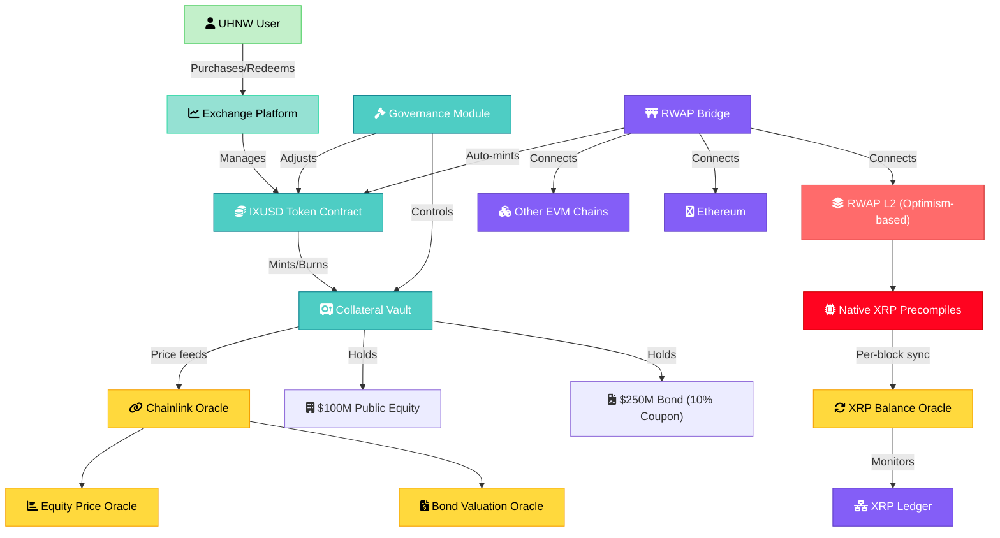

# IXUSD Stablecoin & Exchange Platform Development Plan

## Executive Summary

This comprehensive 10-week project plan outlines the development of IXUSD, a collateralized stablecoin on the RWAP Group's Optimism-based Layer 2 chain with native precompiles (competing with XRPL-EVM), followed by integration into a specialized exchange platform for ultra-high net worth individuals. The stablecoin will be backed by traditional financial assets ($250M bond + $100M equity) with 175% overcollateralization, implementing patterns from established protocols like DAI while adapting for real-world asset collateralization.

## Project Overview

**Total Timeline:** 10 weeks
- Weeks 1-6: IXUSD Stablecoin Development
- Weeks 7-8: Smart Contract Audit & Multi-Chain Deployment
- Weeks 9-10: Exchange Platform Integration

**Key Technologies:**
- RWAP Layer 2: Optimism-based chain with native XRP bridge precompiles
- Cosmos SDK integration for cross-chain interoperability
- Per-block oracle synchronization with XRP Ledger
- Automated minting based on bridged collateral

## Week-by-Week Development Plan

### Week 1: Architecture & Foundation
**Objective:** Establish technical architecture leveraging Optimism's infrastructure

- **Smart Contract Architecture Design**
  - Define core contracts: IXUSD token, Collateral Vault, Oracle Manager, Governance
  - Integrate with RWAP's native precompiles for XRP bridge operations
  - Design CUSIP/securities identifier integration for traditional assets
  - Establish hooks for per-block oracle updates from XRP chain

- **Collateralization Framework**
  - Implement 80% LTV model with real-time valuation
  - Design reserve pool structure for $250M bond + $100M equity
  - Create liquidation mechanisms adapted for illiquid RWA
  - Define emergency pause and governance controls

### Week 2: Core Contract Development
**Objective:** Build fundamental smart contracts with Optimism optimizations

- **IXUSD Token Contract**
  - ERC-20 implementation with minting/burning capabilities
  - Integration with native precompiles for gas-efficient operations
  - Pausable and upgradeable proxy pattern
  - Compliance hooks for securities regulations

- **Collateral Vault System**
  - Multi-asset vault supporting bonds and equity tokens
  - Mark-to-market valuation with oracle integration
  - Position management and liquidation thresholds
  - Fee accrual mechanism for Legacy Exchange Partners

### Week 3: Oracle & Bridge Integration
**Objective:** Implement cross-chain communication and price feeds

- **Oracle Infrastructure**
  - Chainlink integration for traditional asset pricing
  - Custom oracle for bond valuation ($250M cost basis)
  - Equity price feeds from public markets
  - Per-block synchronization with XRP Ledger balances

- **Bridge Integration**
  - Leverage RWAP's existing bridge infrastructure
  - Implement automated minting on collateral bridge events
  - Create redemption pathways across chains
  - Gas optimization using Optimism's rollup benefits

### Week 4: Governance & Risk Management
**Objective:** Establish protocol governance and risk parameters

- **Governance Module**
  - Parameter adjustment mechanisms (LTV, fees, collateral types)
  - Emergency response protocols
  - Multi-sig controls for critical operations
  - Integration with existing RWAP governance

- **Risk Management**
  - Implement circuit breakers for extreme market events
  - Create collateral quality scoring system
  - Design insurance fund mechanics
  - Establish audit trail for compliance

### Week 5: Testing & Optimization
**Objective:** Comprehensive testing on testnet environments

- **Unit Testing**
  - Full coverage of all contract functions
  - Edge case scenarios for liquidations
  - Precompile interaction testing
  - Cross-chain bridge failure scenarios

- **Integration Testing**
  - End-to-end minting/redemption flows
  - Multi-chain deployment simulation
  - Stress testing with high transaction volumes
  - Oracle manipulation resistance

### Week 6: Security Hardening & Documentation
**Objective:** Prepare for audit and deployment

- **Security Enhancements**
  - Implement reentrancy guards
  - Optimize gas consumption
  - Add comprehensive event logging
  - Formal verification preparation

- **Documentation**
  - Technical specification completion
  - User guides for IXUSD operations
  - Integration guides for exchanges
  - Compliance documentation package

### Week 7-8: Audit & Multi-Chain Deployment
**Objective:** Professional audit and systematic deployment

- **Week 7: Security Audit**
  - Engagement with tier-1 audit firm
  - Code freeze and audit preparation
  - Remediation of critical findings
  - Re-audit of fixes

- **Week 8: Multi-Chain Deployment**
  - Mainnet deployment on RWAP L2
  - Cross-deployment to Ethereum mainnet
  - Deployment to Optimism, Base, Arbitrum
  - Bridge verification across all chains

### Week 9-10: Exchange Platform Integration
**Objective:** Integrate IXUSD into UHNW exchange platform

- **Week 9: Core Exchange Integration**
  - IXUSD listing on tokenized securities section
  - Wallet integration for self-custody support
  - Credit card purchase pathway setup
  - Compliance framework adaptation

- **Week 10: Advanced Features & Launch**
  - Implement IXUSD as settlement currency option
  - Create IXUSD/USD liquidity pools
  - Enable collateral monitoring dashboard
  - Launch marketing and user onboarding

## Technical Architecture Diagram

## Key Technical Considerations

### Optimism-Specific Optimizations
- **Native Precompiles**: Leverage RWAP's custom precompiles for gas-efficient XRP bridge operations
- **L2 Gas Optimization**: Design contracts to minimize L1 data posting costs
- **Sequencer Integration**: Handle sequencer downtime gracefully with fallback mechanisms
- **Batch Processing**: Optimize oracle updates and minting operations for rollup efficiency

### Real World Asset Integration
- **Securities Identifiers**: CUSIP/ISIN integration for traditional asset tracking
- **Compliance Layer**: KYC/AML hooks at minting and large redemption points
- **Audit Trail**: Comprehensive logging for regulatory reporting
- **Corporate Actions**: Automated handling of dividends and bond coupon payments

### Risk Management Framework
- **Collateralization Monitoring**: Real-time LTV tracking with automated alerts
- **Liquidation Protection**: Grace periods and partial liquidation options
- **Insurance Fund**: 2% of fees allocated to protocol insurance
- **Emergency Procedures**: Multi-sig pause functionality and governance override

## Success Metrics

1. **Technical Performance**
   - Sub-second minting/redemption times
   - 99.9% oracle uptime
   - Zero critical security vulnerabilities
   - Gas costs 90% lower than Ethereum mainnet

2. **Business Metrics**
   - $200M IXUSD minted at launch
   - Integration with 5+ major exchanges
   - 175% collateralization maintained
   - $5M fee generation for Legacy Exchange Partners

3. **Compliance Achievement**
   - Regulatory approval in target jurisdictions
   - Successful audit completion
   - KYC/AML framework operational
   - Transparent reserve reporting

## Post-Launch Roadmap

- **Month 1-3**: Liquidity bootstrapping and exchange partnerships
- **Month 4-6**: Additional RWA collateral types (real estate, commodities)
- **Month 7-12**: Cross-chain liquidity aggregation and advanced DeFi integrations
- **Year 2**: Expansion to non-EVM chains via Cosmos IBC

This plan leverages RWAP's unique Optimism-based infrastructure with native precompiles to create a technically superior and regulatory-compliant stablecoin solution for the institutional market.
